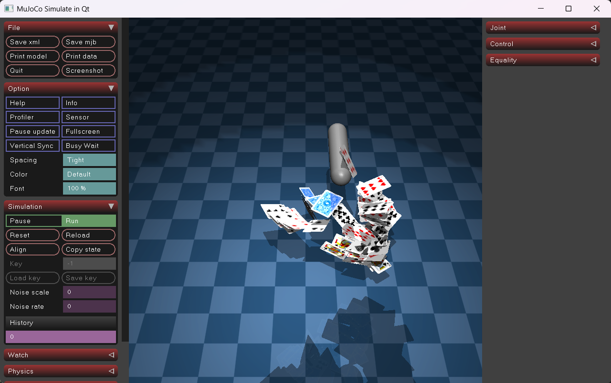

# qt-mujoco

将 MuJoCo 官方 `Simulate` 查看器嵌入 Qt 部件树的集成库。无需 GLFW，直接在任意 `QWidget` 布局中运行完整的 MuJoCo 物理仿真与交互式 3D 渲染。

## 特性

- **零 GLFW 依赖**：用 `QtPlatformUIAdapter` 替换官方 `GlfwAdapter`，所有窗口、OpenGL 上下文、事件均由 Qt 管理。
- **无缝嵌入**：`SimulateView` 是标准 `QWidget`，可与任何 Qt 布局、主窗口或对话框组合使用。
- **多线程架构**：渲染线程与物理仿真线程独立运行，主线程仅处理 Qt 事件，保证 UI 流畅。
- **拖拽加载模型**：直接将 MuJoCo `.xml` 文件拖入窗口即可热切换模型。
- **软件渲染兼容**：内置 Mesa3D 方案说明，支持在无独立 GPU / 虚拟机 / 远程桌面环境下运行。

## 架构

```
SimulateView (QWidget)
└── QtSimulateWindow (QWindow, via createWindowContainer)
    ├── QOpenGLContext          — OpenGL 3.3 Compatibility 上下文
    ├── 渲染线程               — 调用 mujoco::Simulate 渲染循环
    ├── 物理线程               — 调用 mujoco::Simulate 物理步进
    └── QtPlatformUIAdapter    — 实现 PlatformUIAdapter 接口
            ↕ 事件队列（线程安全）
        QWindow 鼠标 / 键盘 / 滚轮事件
```

| 类 | 职责 |
|---|---|
| `SimulateView` | 面向用户的 `QWidget`，封装拖拽和生命周期管理 |
| `QtSimulateWindow` | `QWindow` + OpenGL 上下文 + 双线程调度 |
| `QtPlatformUIAdapter` | Qt → MuJoCo UI 适配层，实现光标、修饰键、剪贴板、垂直同步等接口 |

## 依赖

| 组件 | 版本 |
|---|---|
| Qt | 5.15.2（需含 `widgets`、`opengl` 模块）|
| MuJoCo | 3.8.0 Windows x86_64 |
| 编译器 | MSVC 2019 64-bit（`/utf-8`）|
| OpenGL | 3.3 Compatibility Profile |

## 快速开始

**1. 克隆并配置路径**

在 `demo/main.cpp` 中将模型路径改为你自己的 `.xml` 文件：

```cpp
view->start("path/to/your/model.xml");
```

**2. 用 Qt Creator 打开**

打开 `demo/demo.pro`，选择 `Desktop Qt 5.15.2 MSVC2019 64bit` Kit，直接构建运行。

**3. 虚拟机 / 远程桌面环境（可选）**

若运行时出现 `ERROR: OpenGL ARB_framebuffer_object required`，将 Qt 目录下的 `opengl32sw.dll` 重命名为 `opengl32.dll` 并放至可执行文件同目录（`.pro` 已配置自动拷贝）。

## 在自己的项目中使用

在 `.pro` 文件中引入：

```qmake
include(path/to/src/qt-mujoco.pri)
```

然后直接使用 `SimulateView`：

```cpp
#include "SimulateView.h"

auto *view = new SimulateView(parent);
view->start("model.xml");   // 启动仿真
view->loadModel("new.xml"); // 热切换模型（线程安全）
```

## 效果


