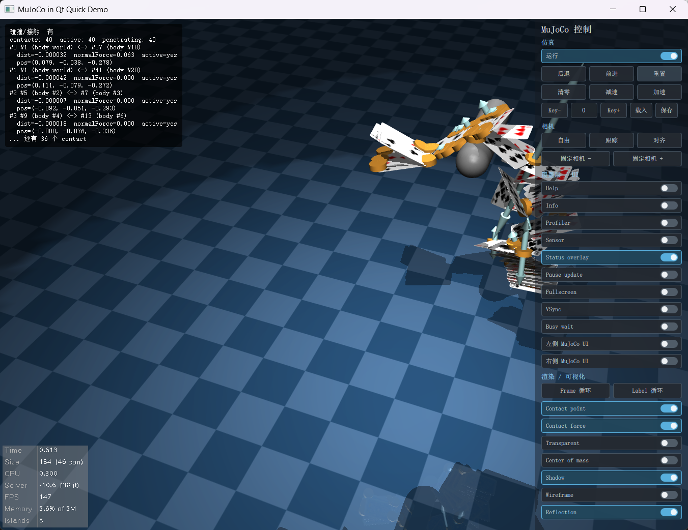

# qt-mujoco

将 MuJoCo 官方 `Simulate` 查看器以 QML 组件的形式嵌入 Qt Quick 应用的集成库。无需 GLFW，直接在 QML 场景中运行完整的 MuJoCo 物理仿真与交互式 3D 渲染。

## 特性

- **零 GLFW 依赖**：用 `QtPlatformUIAdapter` 替换官方 `GlfwAdapter`，所有 OpenGL 上下文、事件均由 Qt 管理。
- **QML 原生组件**：`MujocoView` 继承 `QQuickFramebufferObject`，可与任意 QML 布局、锚点、动画无缝组合。
- **跨上下文共享纹理**：MuJoCo 渲染线程持有私有 `QOffscreenSurface` + `QOpenGLContext`；渲染结果通过 `Qt::AA_ShareOpenGLContexts` 共享的 GL 纹理传递给 Qt Quick scenegraph，无像素级 CPU 回读。
- **帧节拍同步**：MuJoCo 渲染线程严格等待 Qt Quick scenegraph 取走上一帧后再进入下一次 `mjr_render`，避免以 GPU 极限速率生成被丢弃的帧，大窗口下交互保持流畅。
- **三线程架构**：渲染线程、物理仿真线程、Qt 主线程各司其职，互不阻塞。
- **拖拽加载模型**：直接将 `.xml` / `.mjb` 文件拖入窗口即可热切换模型。
- **独立 GPU 优先**：导出 `NvOptimusEnablement` / `AmdPowerXpressRequestHighPerformance` 符号，在双显卡笔记本上自动选用独立 GPU。

## 架构

```
Qt 主线程
└── MujocoView (QQuickFramebufferObject / QML 组件)
        │  鼠标 / 键盘 / 滚轮事件 → PostXxx() → 事件队列
        │
        ├── 渲染线程  (QOffscreenSurface + 私有 QOpenGLContext)
        │       └── mujoco::Simulate::RenderLoop()
        │               └── mjr_render → con_.offFBO (multisample)
        │               └── SwapBuffers: blit → 共享 GL 纹理 → glFlush
        │               └── 等待 scenegraph 消费信号（帧节拍）
        │
        ├── 物理线程
        │       └── mj_step / mj_forward 循环
        │
        └── Qt Quick scenegraph 渲染线程
                └── MujocoFboRenderer::render()
                        └── 将共享纹理 blit 到 Quick FBO → 发出消费信号
```

| 类 | 职责 |
|---|---|
| `MujocoQuickItem` | QML 可用的 `QQuickFramebufferObject`，管理生命周期、输入事件转发 |
| `MujocoFboRenderer` | scenegraph 渲染线程端：把共享纹理 blit 到 Quick 提供的 FBO |
| `QtPlatformUIAdapter` | 实现 `mujoco::PlatformUIAdapter`：offscreen FBO 管理、共享纹理创建、帧节拍 CV、事件队列 |

### 关键设计说明

| 问题 | 解决方案 |
|---|---|
| `con_.offColor_r` 是 renderbuffer，不能跨 context 共享也不能作为纹理采样 | 适配器自行创建 `GL_TEXTURE_2D` + 配套 FBO，在 `SwapBuffers` 里把 multisample offFBO blit 解析到该纹理 |
| `QOpenGLContext` / `QOffscreenSurface` 在渲染线程结束后线程亲和性失效 | 渲染线程退出前调用 `moveToThread(nullptr)` 交出所有权，主线程 `stop()` 再 `moveToThread(currentThread())` 后删除 |
| 大窗口下旋转 / 移动场景卡顿 | `condition_variable` 帧节拍：每帧渲染后等待 scenegraph 消费，使 mjr 循环速率自动与显示器刷新率对齐 |

## 依赖

| 组件 | 版本 |
|---|---|
| Qt | 5.15.2（需含 `quick`、`opengl` 模块）|
| MuJoCo | 3.8.0 Windows x86_64 |
| 编译器 | MSVC 2019 64-bit（`/utf-8`）|
| OpenGL | 3.3 Compatibility Profile |

## 快速开始

**1. 克隆并配置路径**

在 `demo/main.cpp` 中将 `initialXmlPath` 改为你自己的模型路径：

```cpp
engine.rootContext()->setContextProperty(
    "initialXmlPath",
    QStringLiteral("path/to/your/model.xml"));
```

**2. 用 Qt Creator 打开**

打开 `demo/demo.pro`，选择 `Desktop Qt 5.15.2 MSVC2019 64bit` Kit，直接构建运行。

**3. 双显卡笔记本**

`main.cpp` 顶部已导出 `NvOptimusEnablement` 和 `AmdPowerXpressRequestHighPerformance` 符号，NVIDIA / AMD 驱动会自动将本进程切至独立 GPU。

将此代码段复制到你自己项目的 `main.cpp` 顶部（必须在主可执行文件中，静态库 / DLL 中无效）：

```cpp
#if defined(_WIN32)
extern "C" {
    __declspec(dllexport) unsigned long NvOptimusEnablement = 0x00000001;
    __declspec(dllexport) int AmdPowerXpressRequestHighPerformance = 1;
}
#endif
```

## 在自己的项目中使用

**C++ 端**：在 `.pro` 文件中引入，并在 `main()` 里注册 QML 类型：

```qmake
include(path/to/src/qt-mujoco.pri)
```

```cpp
// main.cpp
QGuiApplication::setAttribute(Qt::AA_UseDesktopOpenGL);
QGuiApplication::setAttribute(Qt::AA_ShareOpenGLContexts); // 必须

qmlRegisterType<MujocoQuickItem>("Mujoco", 1, 0, "MujocoView");
```

**QML 端**：

```qml
import Mujoco 1.0

MujocoView {
    anchors.fill: parent
    focus: true

    Component.onCompleted: start("path/to/model.xml")
}
```

**C++ 热切换模型**（线程安全）：

```cpp
mujocoViewItem->loadModel("new_model.xml");
```

**QML 拖拽加载**：demo 中的 `DropArea` 示例可直接复用，将 `.xml` / `.mjb` 拖入窗口即可切换。

## 效果



## 模型库

MuJoCo 官方提供了丰富的示例模型，可在 [MuJoCo 模型库](https://mujoco.readthedocs.io/en/stable/models.html) 中找到。